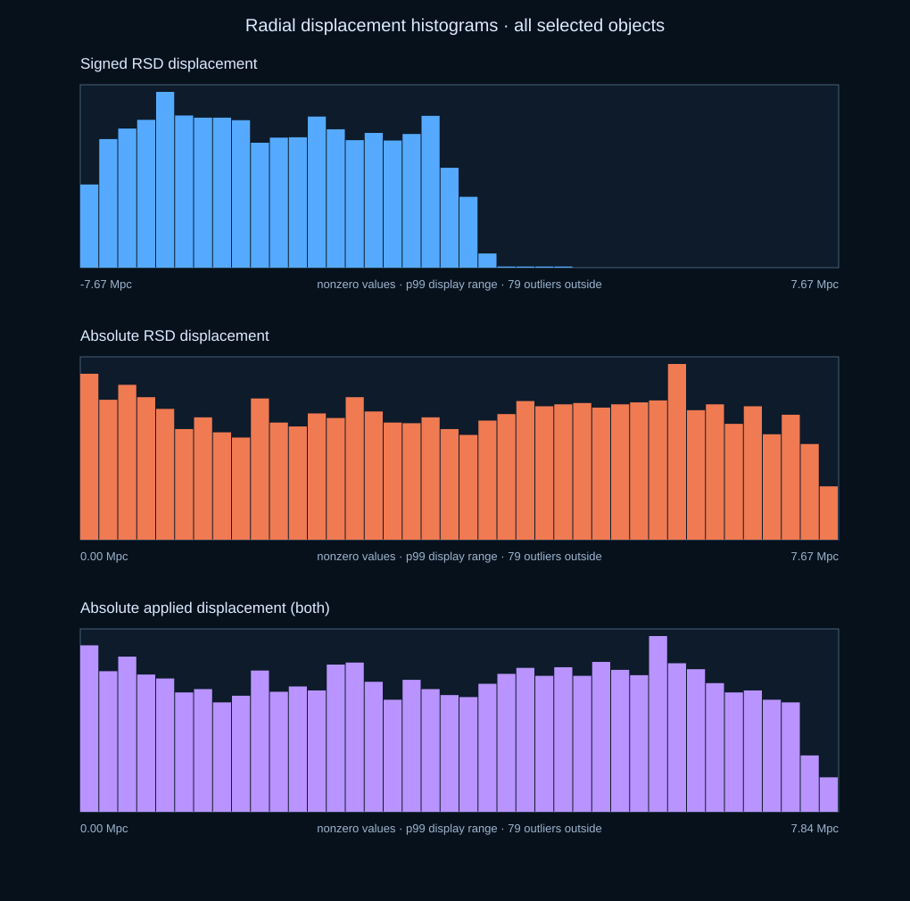

# DESI DR1 FoG and RSD reconstruction review

Python scripts and technical notes for the exploratory Fingers-of-God (FoG) compression and radial redshift-space distortion (RSD) reconstruction used during development of the DESI cosmic-web viewer. **The corrections are disabled in the current viewer release configuration.** Their visual result has not been approved by a DESI scientist; these scripts and outputs are for inspection and independent validation, not a DESI data product or a measured peculiar-velocity catalogue.

The visualization selection contains 15,786,217 DR1 objects (14,140,375 `GALAXY`, 1,645,842 `QSO`). The scripts join by exact unsigned 64-bit `TARGETID` and retain comoving coordinates in physical Mpc using Planck18. No positional nearest-neighbor match is used to assign a FoG or RSD delta to a viewer object. The RSD field-support check based on nearby random points is only an empirical proxy; it is **not** the official survey angular/radial mask.

## Start here: inspect the bundled correction

The private repository contains all inputs needed to compare the stored FoG/RSD candidate with the **observed** positions of 15,786,217 objects. Clone it, install NumPy, run `python verify_review_candidate.py`, then run the region command below. The resulting comparison and histogram are SVG images, which display in browsers and Markdown like PNGs while remaining scalable. Change TARGETID, box width/height/depth in Mly, or `--component rsd|fog|both` to test another area. The catalogues need not be regenerated for this review.

To **recompute** the corrections from original DESI data, use the FoG and RSD sections below in order: download source catalogues, build the exact identity/geometry, generate FoG group deltas, reconstruct RSD fields with appropriate data and random catalogues, materialize per-row payloads, then rerun the verifier and visual comparisons. Recomputing needs the external FITS files and a suitable scientific computing environment. The bundled output is the historical exploratory candidate, not an approved correction.

## Repository contents

| Path | Purpose |
|---|---|
| `sources.json` | Exact DESI download links recorded for zall-pix, Gfinder, LSS clustering data/randoms and independent random realization 1 |
| `download_sources.py` | Resumable Python downloader; produces local size/SHA256 receipts |
| `tools/fog/` | Official Gfinder download/checksum, exact-ID join, memberships, group geometry, FoG deltas and older chunk export |
| `tools/rsd/` | Reconstruction, DR1 identity index, extension/low-z candidates, audits and DR1 materialization |
| `build_dr1_full_catalog.py`, `compact_dr1_catalogs.py`, `build_desi_chunks.py` | Rebuild the historical source geometry and chunk ordering when auditing the exact point index |
| `reports/` | Methodology, coverage and low-z/mask review notes from the original analysis |
| `visualize_target_region.py` | Standalone V3-catalogue comparison of a TARGETID-centered observed volume and its FoG/RSD-corrected positions |
| `desiV3/` | Twelve ready-to-use consolidated catalogue assets, their checksums, and the complete Python rebuild pipeline |
| `review_candidate/` | Exact original-row TARGETID arrays and the 24 FoG/RSD payloads corresponding to the bundled V3 catalogue; exploratory, scientifically unvalidated |
| `verify_review_candidate.py` | Verify SHA256, file lengths, finite deltas and V3 row counts before inspecting a region |

Raw FITS, reconstructed meshes and NumPy caches are excluded. The **current review candidate** correction payloads and exact TARGETID identity arrays are included, so checking stored displacements requires no source downloads or catalogue rebuild. Relative paths assume commands run **from the repository root**. Some historical scripts retain workstation path defaults; pass explicit paths for reconstruction. The two field-generation scripts expose larger-memory options: `extend_rsd_catalog.py --max-rss-gib` and `build_lowz_bgs_field.py --cell-size-mpc-h/--iterations`. All calculated output still requires independent scientific review.

**Historical vs adapted code:** [PROVENANCE.md](PROVENANCE.md) identifies every changed script and gives SHA256 hashes. The four exact originals are in `original/`; all other copied FoG/RSD Python scripts are unchanged. The command examples below use the adapted scripts so their memory and path options are available.

## Visual comparison around one TARGETID

This Python script runs locally and does **not** require the viewer or an online service. A normal authenticated clone of this private repository includes the observed V3 positions, exact TARGETIDs, and the exploratory correction candidate. On macOS/Linux, create an environment and run from the repository root:

```bash
python3 -m venv .venv
source .venv/bin/activate
python -m pip install numpy
python verify_review_candidate.py
python visualize_target_region.py 39627715854207566 \
  --width-mly 500 --height-mly 500 --depth-mly 500 \
  --component both --out local-review/target-39627715854207566
```

Open `comparison.svg` and `histograms.svg` in any browser. `summary.json` gives exact object counts, correction coverage, displacement percentiles and boundary crossings; `histograms.json` stores bin edges and counts, while `largest_displacements.csv` lists the 25 largest applied shifts and exact TARGETIDs. Use `--component rsd` or `--component fog` to isolate either displacement. Objects shifted by applied RSD are colored by radial direction and magnitude: blue for inward, orange/red for outward, saturated at local p95. Applied FoG-only points are amber and unchanged points gray. `--max-points 10000` and `--seed 42` bound and stabilize only the plotted sample; all summary and histogram counts use the full selected volume. `--histogram-bins 40` changes bin count. Histogram bars exclude exact zeros, display through the 99th percentile, and report zeros/outliers separately in JSON. Width and height are axes perpendicular to the Earth-to-target line of sight, while depth follows that line. The box is centered on the target's **observed** position. Both columns contain the same TARGETIDs selected in that observed box, even if their corrected positions cross a boundary; both use the same plot limits. The red cross follows the central TARGETID. Radial deltas are in physical Mpc and are converted to Mly only for display. An SVG can contain many points, so lower `--max-points` for large volumes.

See [four reproducible examples](examples/README.md), including the generated plots and commands for a nearby RSD field, a mixed RSD/FoG region, an FoG-only comparison, and a distant region.




## Rebuild the current visualization catalogue

The twelve active `desiV3_catalog_***.bin.gz` files are [included directly in this private repository](desiV3/catalogs/), together with their [SHA256 checksums](desiV3/catalogs/SHA256SUMS) and a [matching manifest](desiV3/catalogs/desiV3-consolidated-manifest.json). A normal authenticated Git clone obtains the data without running the source downloads or SQL imaging recovery. On Linux, verify with `sha256sum -c desiV3/catalogs/SHA256SUMS`; on macOS use `shasum -a 256 -c desiV3/catalogs/SHA256SUMS` from the repository root.

To regenerate them independently, follow the [complete macOS and Linux reproduction guide](desiV3/REPRODUCE_CURRENT_CATALOG.md) for source downloads, exact DR1 row selection and partitioning, imaging recovery, file-format validation, deployment-ready names and rollback/reference hashes. These catalogue files contain observed positions; the exploratory FoG/RSD correction payloads are separate.

This is a visual diagnostic of the stored correction, not a new reconstruction or scientific validation of the survey mask. The bundled candidate was materialized against the same original-row ordering used by V3. `verify_review_candidate.py` checks integrity, dimensions and finite values; SHA256 cannot independently prove that the underlying reconstruction or its selection function is physically correct. If substituting another correction candidate, first establish exact row-order identity and retain its materialization report.

## Sources and download links

- Full observed-target redshift catalogue: [DESI DR1 `zall-pix-iron.fits`](https://data.desi.lbl.gov/public/dr1/spectro/redux/iron/zcatalog/v1/zall-pix-iron.fits).
- FoG: [DR1 Gfinder v1.0 directory](https://data.desi.lbl.gov/public/dr1/vac/dr1/gfinder/v1.0/) containing `DESIDR9.y1.v1_galaxy.fits`, `DESIDR9.y1.v1_group.fits`, `iDESIDR9.y1.v1_1.fits` and `dr1_vac_dr1_gfinder_v1.0.sha256sum`. The exact four URLs are in `sources.json` and `tools/fog/data_sources.json`.
- RSD: [DR1 LSS iron LSScats v1.5](https://data.desi.lbl.gov/public/dr1/survey/catalogs/dr1/LSS/iron/LSScats/v1.5/). The base run used 10 `clustering.dat.fits` files and their matching index-0 `clustering.ran.fits` files for BGS_BRIGHT-21.5, LRG, LRG+ELG_LOPnotqso, ELG_LOPnotqso and QSO in NGC/SGC. Index-1 random files were downloaded for independent-realization diagnostics.
- The continuous low-z candidate uses `BGS_BRIGHT` NGC/SGC `clustering.dat` and matching random indices 0 and 1 from that same directory; the BGS_BRIGHT-21.5 files have no data below `z=0.10`.
- Method/code references: [DESI DR1 documentation](https://data.desi.lbl.gov/doc/releases/dr1/), [DESI LSS data model](https://desidatamodel.readthedocs.io/en/latest/DESI_ROOT/survey/catalogs/RELEASE/LSS/SPECPROD/LSScats/VERSION/index.html), [pyrecon](https://github.com/cosmodesi/pyrecon), [Gfinder release documentation](https://data.desi.lbl.gov/doc/releases/dr1/vac/gfinder/).

Download examples (the first FoG command verifies the official Gfinder checksum; the generic downloader records size and local SHA256):

```bash
python tools/fog/fog.py --data-dir data_external/desi/dr1/gfinder/v1.0 download
python tools/fog/fog.py --data-dir data_external/desi/dr1/gfinder/v1.0 verify
python download_sources.py --group dr1_zcatalog --dest data
python download_sources.py --group rsd_base --dest data_external/RSD
python download_sources.py --group bgs_lowz --dest tools/rsd/lowz_sources
python download_sources.py --group rsd_validation_index1 --dest tools/rsd/validation_sources
```

Use `--dry-run` with `download_sources.py` to inspect all URLs and destinations before transferring multi-GB files. The download helper validates response length and records SHA256 locally; `sources.json` does not assert an official SHA256 for LSS FITS. Retain the official source/version and receipts with any scientific output.

## Environment and memory

Use Python 3.11+ on Linux or WSL for the RSD scripts that use `resource`. Install `requirements.txt` in a virtual environment; pyrecon's FFT/MPI dependencies may require its [official build instructions](https://pyrecon.readthedocs.io/en/stable/user/building.html). Record exact package versions with `python -m pip freeze` for a reproducible run. Gfinder matching additionally imports `desitarget.targets.encode_targetid`.

The original workstation had constrained RAM. Its exploratory large-scale profile used **16 h⁻¹ Mpc** cells, 3 iterations and, for some extensions, a reconstruction random stride copied from reference reports. The grid is much coarser than a 4 h⁻¹ Mpc comparison profile. Coarser cells reduce FFT memory, but do not validate the science. Run fields sequentially, not concurrently; the preflight estimate is a lower bound and should leave substantial memory headroom.

## FoG: reproduce the group compression

1. Build the historical v3 LSS `.desi` inputs in `assets/` if they are available; `tools/fog/build_viewer_index.py` specifically expects `BGS_BRIGHT`, `LRG`, `ELG`, `QSO` v3 files with embedded TARGETID. This original FoG matching stage used the earlier LSS viewer selection, not all 15.8 million DR1 objects. The final DR1 materializer below matches its output to the current full catalogue.
2. Download and verify Gfinder. Its ~17 GB of three FITS inputs should remain outside Git.
3. Run the exact ID/group pipeline in order:

```bash
python tools/fog/build_viewer_index.py --assets assets --out data_external/fog/viewer-target-index.npz
python tools/fog/match_gfinder.py --index data_external/fog/viewer-target-index.npz --gfinder data_external/desi/dr1/gfinder/v1.0/DESIDR9.y1.v1_galaxy.fits --out data_external/fog/matches --batch 1000000
python tools/fog/resolve_groups.py --matches data_external/fog/matches --out data_external/fog/groups --relation data_external/desi/dr1/gfinder/v1.0/iDESIDR9.y1.v1_1.fits --groups data_external/desi/dr1/gfinder/v1.0/DESIDR9.y1.v1_group.fits --batch 1000000
python tools/fog/collect_members.py --groups-dir data_external/fog/groups --out data_external/fog/members --relation data_external/desi/dr1/gfinder/v1.0/iDESIDR9.y1.v1_1.fits --galaxy data_external/desi/dr1/gfinder/v1.0/DESIDR9.y1.v1_galaxy.fits --minimum-richness 5 --batch 1000000
python tools/fog/analyze_fog.py --members data_external/fog/members --groups data_external/fog/groups --matches data_external/fog/matches --out data_external/fog/analysis --min-spec 5 --elongation 1.5 --alpha-min 0.08 --max-delta-mpc 300
```

The last command writes sorted `TARGETID -> delta_mpc` and group statistics. It estimates robust radial and transverse spread for groups with at least five spectroscopic members. A group receives compression only above the elongation threshold. `--minimum-richness`, `--min-spec`, `--elongation`, `--alpha-min` and `--max-delta-mpc` are **model choices**, not DESI-approved constants. Report how coverage and extreme displacements change if varying them. See `reports/FOG_COVERAGE_PLAN.md`; the original output had 595,821 exact DR1 matches and 195,200 nonzero deltas, including outliers that require group-membership review.

For a machine with more RAM, `--batch 4000000` can reduce streaming overhead in matching/collection, provided memory is measured. `analyze_fog.py` concatenates intermediate arrays and has no bounded-memory switch: increasing `--batch` does not make that final stage safe on a small machine. A lower-RAM run should keep batches at or below one million; a substantially larger analysis requires refactoring the final join or using a machine with sufficient RAM. Do not change FoG thresholds merely to increase coverage.

## RSD: reconstruct and audit

### 1. Prepare exact current-catalogue identity

The DR1-specific `build_dr1_chunk_index.py` verifies the order against the **historical twelve point chunks** and compact v2 `.desi` files. It fails closed when geometry, counts or redshift order differ. The `zall-pix` source is required. If rebuilding inputs from scratch, the historical full selection used `--min-reliable-z 0`; first create v3 files, compact them with the Python compactor, and ensure `assets/DR1_*.desi` are the compact v2 copies before indexing. Keep the full v3 copies elsewhere locally. Rebuilding with the current default 20 Mpc reliability floor creates a different selection and cannot be substituted into the historical exact index.

```bash
python build_dr1_full_catalog.py --source data/zall-pix-iron.fits --out assets/v3 --min-reliable-z 0
python compact_dr1_catalogs.py --source-dir assets/v3 --out-dir assets
# Historical point chunks/manifest.json must be placed in ply/chunks before this check:
python tools/rsd/build_dr1_chunk_index.py --source data/zall-pix-iron.fits --assets assets --chunks ply/chunks --out ply/reconstruction_dr1/private_index
```

The private `targetid_*.npy` files are an offline identity index, not web assets. If a newly built point manifest differs from the historical one, regenerate geometry and validate it separately; never attach deltas to a different row order.

### 2. Inspect, estimate resources and reconstruct reference fields

`rsd_config.json` defines five half-open redshift intervals, tracer bias/growth values, smoothing and a default 16 h⁻¹ Mpc grid. `rsd_pipeline.py` uses `pyrecon.IterativeFFTReconstruction`, local line of sight, weights `WEIGHT × WEIGHT_FKP` where present, NGC/SGC fields and Planck18 distances. The radial displacement is `delta_r = -dot(read_shifts(x, field="rsd"), x/|x|)` in physical Mpc. The sign convention comes from reconstructed position `x - shift`.

```bash
python tools/rsd/rsd_pipeline.py --data-dir data_external/RSD sources --out data_external/RSD/source-manifest-local.json
python tools/rsd/rsd_pipeline.py --data-dir data_external/RSD preflight --sample 10000 --cell-size 16
python tools/rsd/rsd_pipeline.py --data-dir data_external/RSD --tracer LRG prototype --region NGC --limit 100000 --random-factor 5 --cell-size 16
python tools/rsd/rsd_pipeline.py --data-dir data_external/RSD --tracer BGS reconstruct --out data_external/RSD/derived/rsd-16 --limit 0 --random-limit 0 --cell-size 16 --iterations 3
```

Repeat `reconstruct` for each tracer, one at a time; each command processes both NGC and SGC. `0` means the full selected data/random catalogue, not zero rows. Each region writes an exact-ID query cache and a report. Check counts, finite shifts, mesh geometry, source filenames and the achieved memory peak. `collect-reports --out ... --expected-fields 10` checks that all ten reports and caches are present. If continuing a partially completed run, inspect the output directory first to avoid mixing parameter profiles.

### 3. More RAM / finer mesh example

This is a **new candidate**, not the original calculation. Use a separate output directory and preflight the same cell size before reconstructing:

```bash
python tools/rsd/rsd_pipeline.py --data-dir data_external/RSD --tracer QSO preflight --sample 20000 --cell-size 8
python tools/rsd/rsd_pipeline.py --data-dir data_external/RSD --tracer QSO reconstruct --out data_external/RSD/derived/rsd-8 --limit 0 --random-limit 0 --cell-size 8 --iterations 3
```

At fixed box dimensions, halving cell size can increase cell count by roughly **8×**, and FFT working memory can grow similarly or more. A 4 h⁻¹ Mpc run may require far more than a 16 h⁻¹ Mpc run. `preflight` uses sampled bounds and reports only a lower-bound estimate; run one field with process RSS monitoring and leave headroom. Do not run ten fields concurrently. Changes to grid, smoothing, random sampling or iterations require new reports, caches, support checks and scientific comparisons. The extension script can now accept an explicit larger `--max-rss-gib` on a higher-memory machine, but it still requires source/mesh/sign/correlation gates to match the chosen reference reports; increasing RAM alone cannot make a 16 h⁻¹ Mpc cache equivalent to an 8 h⁻¹ Mpc field.

### 4. Low-z BGS field and full-catalogue extension

The original BGS_BRIGHT-21.5 LSS selection begins at approximately `z=0.10`. The separate BGS_BRIGHT candidate uses `[0.01,0.40)`, random index 0 for reconstruction and index 1 for diagnostics. The recorded limited-memory candidate used every sixth random (`--random-stride 6`) and 16 h⁻¹ Mpc cells:

```bash
python tools/rsd/audit_lowz_bgs_inputs.py
python tools/rsd/build_lowz_bgs_field.py --random-stride 6 --batch-size 100000 --cell-size-mpc-h 16 --iterations 3
python tools/rsd/validate_lowz_bgs_field.py
python tools/rsd/audit_lowz_random_realizations.py
```

On a larger machine, evaluate a separate candidate with `--random-stride 1 --cell-size-mpc-h 8 --batch-size 50000`, after saving the first candidate directory. Stride 1 uses all selected reconstruction randoms and the finer grid raises FFT cost; batch size limits query memory, not mesh memory. `build_lowz_bgs_field.py` writes to its fixed `tools/rsd/lowz_sources/field_candidate` directory, so move/copy the prior candidate before rerunning. Compare outputs and validate the mask at `z≈0.01`, `0.10` and `0.40`; the low-z correction changed previously shared BGS deltas materially. The empirical random-cloud p99 support is not sufficient for scientific approval.

`extend_rsd_catalog.py` queries additional current-catalogue positions while the reconstructed mesh is alive. It requires the reference cache and field reports plus exact private index. Example for one field and region, with an explicit memory stop on a larger machine:

```bash
python tools/rsd/extend_rsd_catalog.py --data-dir data_external/RSD --cache-dir data_external/RSD/derived/rsd-16 --assets assets --chunks ply/chunks --index ply/reconstruction_dr1/private_index --out tools/rsd/extensions --tracer BGS --region NGC --cell-size-mpc-h 16 --max-rss-gib 24
```

This remains sequential and is sensitive to the full viewer arrays, random KD-tree and FFT mesh. The report and extension are review-only. `--use-reference-random-stride` reproduces the reference report's reconstruction random stride; without it the script uses full randoms and will reject a reference report built with subsampling. Never relax the fixed p99 support or comparison gates just to obtain more matches. See `reports/MASK_VALIDATION_2026-09-24.md`.

### 5. Materialize, compare, and keep disabled

`materialize_dr1_corrections.py` combines the FoG exact-ID table and RSD caches/extensions into twelve aligned Float32 payloads. An unvalidated extension/low-z candidate requires `--stage-unvalidated-rsd` and a **new empty output directory**. This is a local visual-review export, not scientific sign-off:

```bash
python tools/rsd/materialize_dr1_corrections.py --assets assets --chunks ply/chunks --index ply/reconstruction_dr1/private_index --fog data_external/fog/analysis/targetid-delta.npy --rsd-cache data_external/RSD/derived/rsd-16 --rsd-extensions tools/rsd/extensions --bgs-lowz-candidate tools/rsd/lowz_sources/field_candidate --stage-unvalidated-rsd --out ply/reconstruction_dr1/review-run-01
python tools/rsd/materialize_dr1_lod_pairs.py --catalogs assets --index ply/reconstruction_dr1/private_index --payloads ply/reconstruction_dr1/review-run-01 --out ply/reconstruction_dr1/review-lod-01
```

Inspect all JSON reports and compare source checksums, counts, finite values, sign, shift distribution, coverage by tracer/region/redshift, mask edges, source-coordinate vs viewer-coordinate queries, point/LOD identity and visual behavior against the observed view. Do not label the output as a validated real-space catalogue. The current visualization keeps RSD/FoG disabled; publishing a new correction requires an independent review decision and reconnecting archived assets.

## What remains scientifically unresolved

The selection/mask and completeness outside exact LSS members; BGS low-z field parameters and random-stride convergence; sensitivity to mesh, bias, growth and smoothing; extreme FoG group members and QSO interpretation; visual discontinuities and independent mocks/reference comparisons. The reports in `reports/` provide the original computational checks and limitations. A collaborator can use these scripts to debug the calculation, but their successful execution only establishes a reproducible *candidate*.

## Provenance and reuse

This private repository contains original project scripts and notes. DESI input files are linked, not mirrored; follow DESI's release documentation and citation requirements when using them. No licence has been assigned to this repository yet. Exact historical results also depend on the original source file versions, package versions and published point-chunk ordering recorded in the local manifests; preserve their hashes in any independent rerun.
