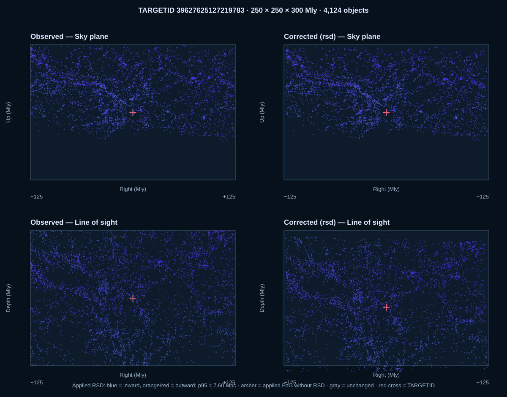
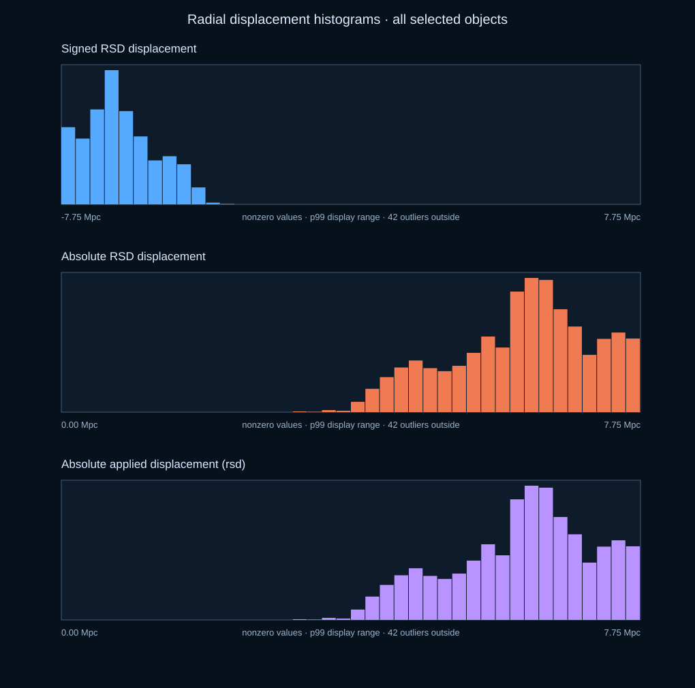
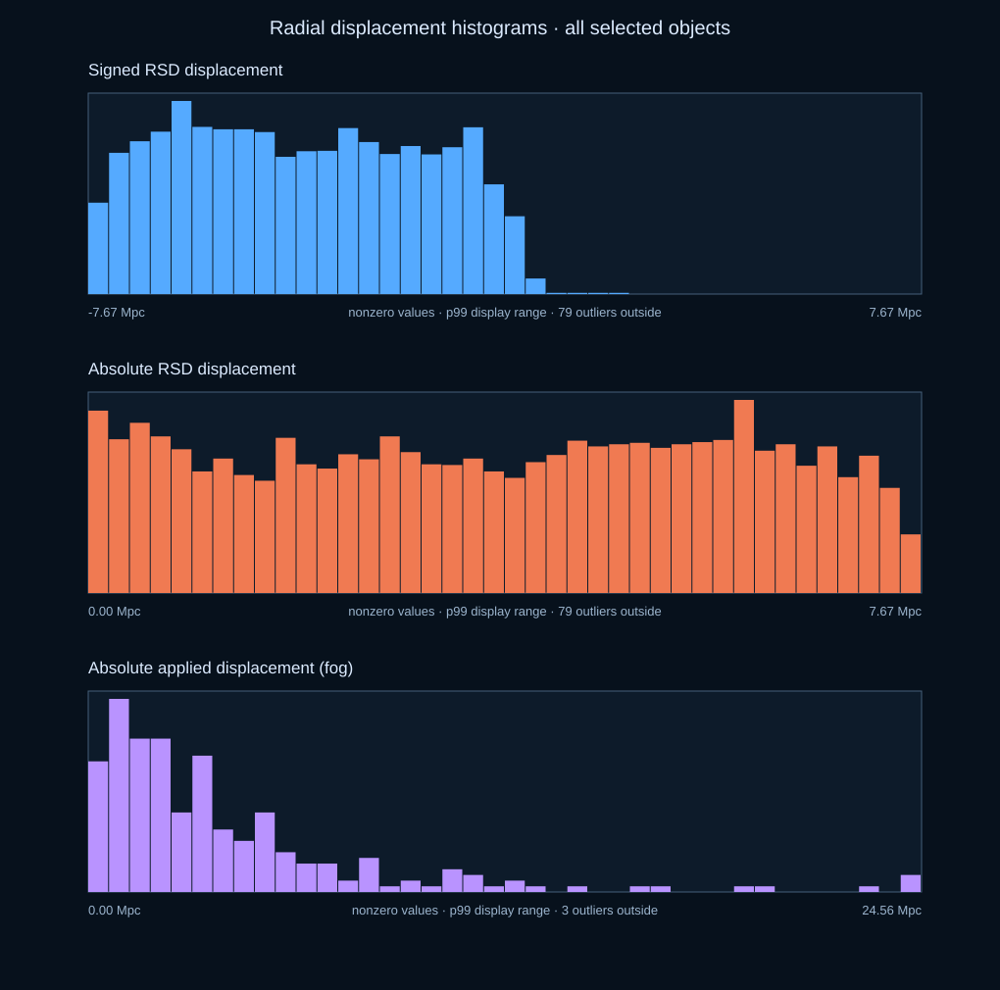
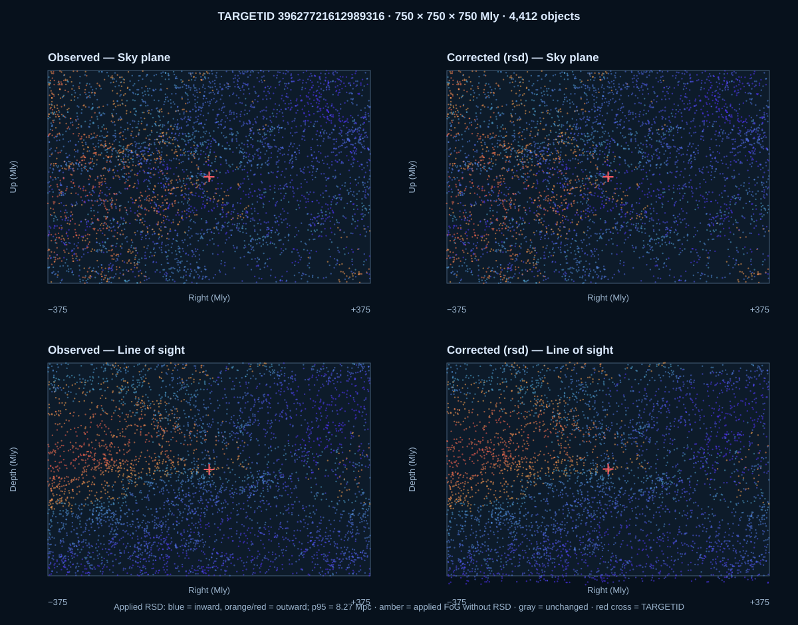
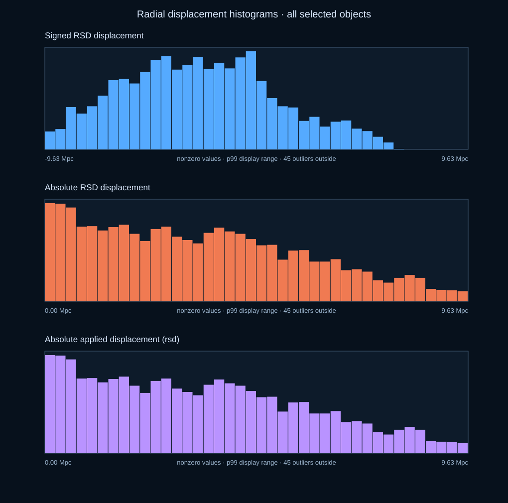

# Local correction-preview examples

These four examples use the bundled V3 catalogue, exact TARGETID identity arrays and **unvalidated** correction payloads in this private repository. The SVGs are visual diagnostics of stored deltas, not evidence that the RSD/FoG reconstruction is scientifically correct. They open directly in a browser and do not use the viewer. Run commands from the repository root after `python -m pip install numpy` and `python verify_review_candidate.py`. No external data download is needed. Replace `--corrections` only after verifying another candidate has identical row ordering.

| Example | TARGETID | Box (Mly) | Applied component | Observed-box objects | Nonzero applied shifts |
|---|---:|---:|---|---:|---:|
| [Nearby RSD](output/nearby-rsd/comparison.svg) | `39627625127219783` | 250 × 250 × 300 | RSD | 4,124 | 4,123 |
| [Midrange combined](output/midrange-both/comparison.svg) | `39627715854207566` | 500 × 500 × 500 | FoG + RSD | 7,819 | 7,818 |
| [Same midrange box, FoG only](output/midrange-fog/comparison.svg) | `39627715854207566` | 500 × 500 × 500 | FoG | 7,819 | 235 |
| [Distant RSD](output/distant-rsd/comparison.svg) | `39627721612989316` | 750 × 750 × 750 | RSD | 4,412 | 4,411 |

Each output directory contains `comparison.svg`, [displacement histograms](output/midrange-both/histograms.svg), `summary.json`, `histograms.json`, and `largest_displacements.csv`. **All selected objects are plotted** in these four examples; the 10,000-point cap is above every example's object count. Histogram bins exclude exact zeros and display through the 99th percentile; the JSON records zero and outlier counts. The same observed TARGETIDs appear in both comparison columns, and each output reports how many corrected positions crossed the fixed observed-box boundary.

## 1. Nearby low-redshift RSD region

The center is about 284 Mpc from Earth. This example is useful near the BGS low-z reconstruction regime. Its 4,123 nonzero RSD deltas have a median absolute magnitude of 6.30 Mpc; 87 corrected objects leave the observed box.

```bash
python visualize_target_region.py 39627625127219783 \
  --width-mly 250 --height-mly 250 --depth-mly 300 \
  --component rsd --max-points 10000 --out examples/output/nearby-rsd
```

[Comparison](output/nearby-rsd/comparison.svg) · [Histograms](output/nearby-rsd/histograms.svg) · [Summary](output/nearby-rsd/summary.json)





## 2. Midrange FoG and RSD together

This 500 Mly cube contains 7,819 observed objects. It has 7,818 nonzero RSD values and 235 nonzero FoG values. The median absolute applied displacement is 3.88 Mpc; 110 corrected objects leave the box.

```bash
python visualize_target_region.py 39627715854207566 \
  --width-mly 500 --height-mly 500 --depth-mly 500 \
  --component both --max-points 10000 --out examples/output/midrange-both
```

[Comparison](output/midrange-both/comparison.svg) · [Histograms](output/midrange-both/histograms.svg) · [Summary](output/midrange-both/summary.json)


## 3. Same volume with FoG only

Use the identical center and dimensions to isolate the group compression. Exactly 235 points have a nonzero FoG delta and 24 leave the observed box after this component alone. RSD values are still reported in the diagnostic histogram but are **not applied** or used to color points in the comparison.

```bash
python visualize_target_region.py 39627715854207566 \
  --width-mly 500 --height-mly 500 --depth-mly 500 \
  --component fog --max-points 10000 --out examples/output/midrange-fog
```

[Comparison](output/midrange-fog/comparison.svg) · [Histograms](output/midrange-fog/histograms.svg) · [Summary](output/midrange-fog/summary.json)




## 4. Distant RSD region

The center is about 3,066 Mpc from Earth. This larger box holds 4,412 observed objects, 4,411 with a nonzero RSD delta. The median absolute RSD displacement is 3.36 Mpc; 123 corrected objects leave the box.

```bash
python visualize_target_region.py 39627721612989316 \
  --width-mly 750 --height-mly 750 --depth-mly 750 \
  --component rsd --max-points 10000 --out examples/output/distant-rsd
```

[Comparison](output/distant-rsd/comparison.svg) · [Histograms](output/distant-rsd/histograms.svg) · [Summary](output/distant-rsd/summary.json)





For a new area, replace TARGETID and the three Mly dimensions, and choose `--component rsd`, `fog` or `both`. Increase `--max-points` only if the SVG remains manageable. Keep the V3 catalogue and correction payloads in the same exact row order; mismatched row order would create a misleading comparison.
